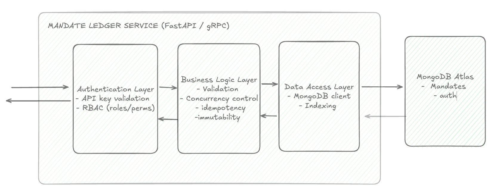
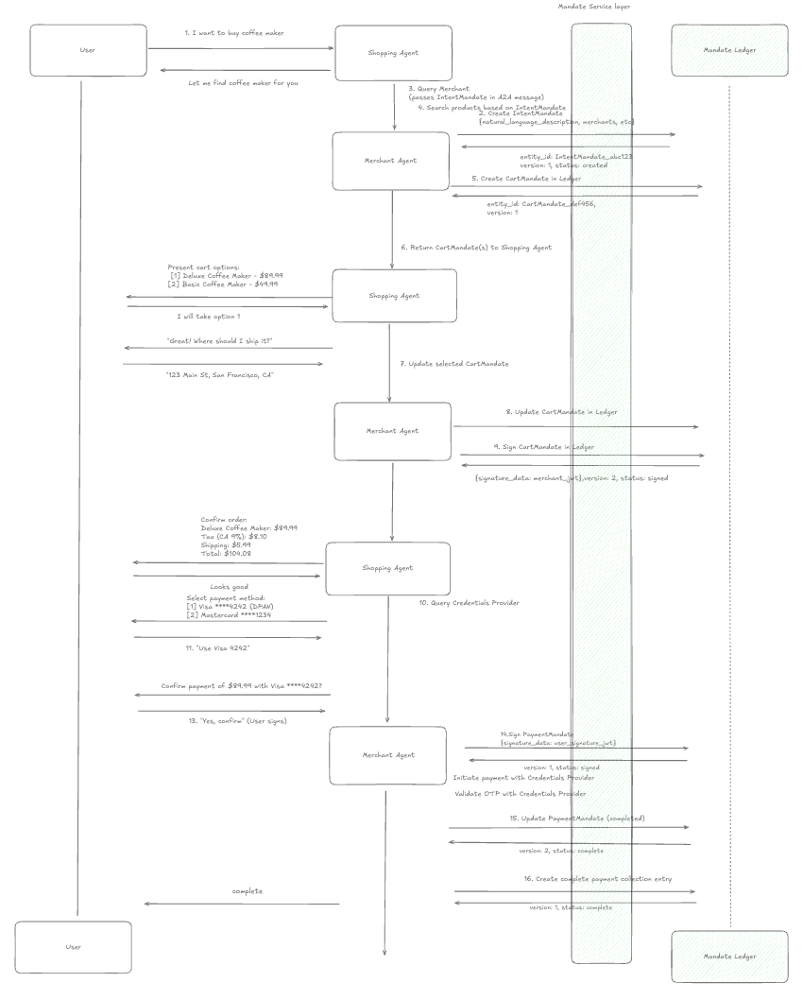

# retail-agent-shopping-ap2-ucp 

[](LICENSE)
[](https://www.mongodb.com/)
[](https://fastapi.tiangolo.com/)

## 🎯 Overview

This Proof of Concept (PoC) demonstrates an enterprise-grade agentic commerce system built around the **Agent Payment Protocol (AP2)**. At its core, **MongoDB Atlas** serves as the immutable **Mandate Ledger** – a highly secure, scalable, and auditable document database establishing the canonical System of Record for all AP2 transactions throughout the agentic commerce lifecycle.

---

## 🏗️ Architecture

The system consists of multiple agents communicating via **Agent-to-Agent (A2A)** or **Universal Commerce Protocol (UCP)** to execute transactions. MongoDB Atlas serves as the central, immutable ledger.

> **NEW:** See the [UCP + AP2 Integration Guide](docs/UCP_AP2_INTEGRATION.md) to understand how AP2 works with the Universal Commerce Protocol.

### Service Layer Protection

The **Mandate Ledger Service** acts as a protective middleware between agents and the database, **preventing direct database modifications**:

| Layer | Responsibility |
|-------|----------------|
| **Authentication Layer** | API key validation, role-based access control (RBAC) |
| **Business Logic Layer** | Validation, concurrency control, idempotency, immutability |
| **Data Access Layer** | MongoDB client with optimized indexing |

All operations flow through this service layer ensuring audit trails, state machine validation, and secure access.



### Transaction Flow

The complete payment lifecycle flows through three mandate types:

1. **IntentMandate** – User's shopping intent (signed by Shopping Agent)
2. **CartMandate** – Merchant's product offer (signed by both parties)
3. **PaymentMandate** – User's payment authorization (signed → completed)
4. **Payment Record** – Ultra-lean completion record referencing all mandates



---

## 📋 Prerequisites

- Python 3.12+
- MongoDB Atlas or local MongoDB 7.0+
- Google API Key ([Get one](https://aistudio.google.com/apikey)) or Vertex AI access
- [`uv`](https://docs.astral.sh/uv/) (optional)

---

## 🚀 Setup & Run

### Step 1: Install Ledger Service

```bash
git clone https://github.com/mongodb-industry-solutions/retail-agent-shopping-ap2-ucp.git
cd retail-agent-shopping-ap2-ucp/mandate_ledger_service

python3.12 -m venv .venv
source .venv/bin/activate
pip install -e .
```

Create `.env` file in `mandate_ledger_service/`:

```bash
MONGODB_URI= # Your connection string
MONGODB_DATABASE=mandate_ledger
SERVICE_NAME=mandate-ledger-service
ENVIRONMENT=development

# Bootstrap Auth (dev only - set to false after Step 2)
BOOTSTRAP_ADMIN_KEY=****  # Generate: openssl rand -hex 32
ENABLE_BOOTSTRAP_AUTH=true

ALLOWED_CORS_ORIGINS=*
DEFAULT_RATE_LIMIT_PER_MINUTE=60
```

Start the service:
```bash
uvicorn src.main:app --reload --port 5000
```

Or run the Mandate Ledger Service with Docker:

```bash
docker build -f mandate_ledger_service/Dockerfile -t mandate-ledger ./mandate_ledger_service

docker run --rm \
	-p 5000:5000 \
	--env-file mandate_ledger_service/.env \
	mandate-ledger
```

### Step 2: Generate Agent API Keys

Open a new terminal and run:
```bash
cd mandate_ledger_service
source .venv/bin/activate
PYTHONPATH=. python3 scripts/setup_agent_keys.py
```

Copy the **Merchant Agent API Key** from output. Then edit `.env` and set `ENABLE_BOOTSTRAP_AUTH=false`, restart service.

> **Production:** Use a secrets manager (Google Secret Manager, AWS Secrets Manager) and implement key rotation.

### Step 3: Configure Backend

> The /backend is adapted from the official [Google's AP2 repo](https://github.com/google-agentic-commerce/AP2/tree/main). Here we use the AP2 + A2A sample.

This /backend service interacts with the Mandate Ledger Service, pushing new mandates into the ledger.

Create `.env` file in `/backend`.
`MANDATE_LEDGER_API_KEY` is your `mlsk_merchant_key_from_step2`.

```bash
GOOGLE_API_KEY=
MANDATE_LEDGER_SERVICE_URL=http://localhost:5000
MANDATE_LEDGER_API_KEY=
```


For Vertex AI, replace first line with:
```bash
GOOGLE_GENAI_USE_VERTEXAI=true
GOOGLE_CLOUD_PROJECT=your-project-id
GOOGLE_CLOUD_LOCATION=us-central1
```

Build and run the backend container:

```bash
docker build -f backend/Dockerfile -t retail-backend ./backend

docker run --rm \
	-p 8000:8000 \
	-p 8001:8001 \
	-p 8002:8002 \
	-p 8003:8003 \
	-p 8004:8004 \
	--env-file backend/.env \
	retail-backend
```

This starts the main backend API on `http://localhost:8000` and automatically launches the AP2 agents required by the demo.


### Step 4: Configure Frontend (NextJS app)

The Frontend contains a NextJS application which interacts with the /backend service.

Create a frontend env file from the example and set the backend and assistant endpoints:

```bash
cd frontend
cp EXAMPLE.env .env.local
```

Update `frontend/.env.local` with your values:

```bash
MONGODB_URI=<your-mongodb-string>
MONGODB_DATABASE=<your-database-name>
NEXT_PUBLIC_BACKEND_ENDPOINT=http://localhost:8000
ASSISTANT_ENDPOINT=http://localhost:3333
```

Install frontend dependencies:

```bash
cd frontend
npm install
npm run dev
```

Run frontend:

```bash
npm run dev
```

Or build and run the frontend container using the root Dockerfile.

#### Required for Suggested Replies in Chat UI

The main app chat experience uses auto-generated suggested replies (quick-pick options) instead of free-text user input.
These suggested replies are generated by an external assistant microservice that must be running alongside this project:

- Assistant Microservice Repo: https://github.com/mongodb-industry-solutions/retail-ap2-assistant

Follow that repository's README to set up and run the service before starting the demo if you want suggested replies enabled in the Next.js app.

If the assistant service is not running, the main app can still load, but suggested replies will not be generated.

### Step 5: Run Demo

With all required services configured, and the 3 services running in separate terminals:

1. Open the main app in your browser:

`http://localhost:8080`

The backend API remains available at `http://localhost:8000`.

Follow the [USER_GUIDE](USER_GUIDE.md) for full instructions on navigating the main application interface.

---

## 🔑 Key Features

### Mandate Ledger Service

| Feature | Description |
|---------|-------------|
| **Immutability** | No UPDATE/DELETE operations – append-only ledger |
| **Authentication** | API key validation per agent |
| **RBAC** | Role-based access control by agent type |
| **Idempotency** | Safe retries via `X-Idempotency-Key` header |
| **Audit Trail** | Complete history of all operations |

## 📁 Repository Structure

```
├── frontend/                      # Next.js main demo application (UI)
│   ├── app/                       # App router pages + API routes
│   ├── components/                # Reusable UI components
│   ├── lib/                       # API and utility helpers
│   └── redux/                     # Store and slices
│
├── backend/                       # AP2 + A2A backend service
│   ├── agents/                    # AP2 agents and role logic
│   ├── routers/                   # FastAPI route handlers
│   └── db/                        # Backend DB integration
│
├── mandate_ledger_service/        # 🔐 Immutable Mandate Ledger microservice
│   ├── src/
│   │   ├── api/                   # Service endpoints
│   │   ├── core/                  # State machine + validation
│   │   ├── repositories/          # Data access layer
│   │   └── services/              # Business service layer
│   ├── scripts/                   # Setup utilities (agent keys, MongoDB)
│   └── docs/                      # Ledger service docs
│
├── example/                       # 🛍️ End-to-end protocol demos
│   ├── card_flow/                 # A2A flow demo
│   ├── ucp_flow/                  # UCP flow demo
│   └── src/                       # Shared AP2/common/roles code
│
├── docs/                          # 📖 Project documentation
├── assets/                        # Diagrams and guide images
├── docker-compose.yml             # Multi-service local orchestration
└── Dockerfile.frontend            # Frontend container build
```

---

## 📚 Documentation

- [API Reference](mandate_ledger_service/docs/API_REFERENCE.md) – Complete endpoint docs
- [Bootstrap Auth](mandate_ledger_service/docs/BOOTSTRAP_AUTH_SETUP.md) – API key setup
- [Card Flow Details](example/card_flow/README.md) – A2A demo walkthrough
- [UCP Flow Details](example/ucp_flow/README.md) – UCP demo walkthrough
- [UCP + AP2 Integration](docs/UCP_AP2_INTEGRATION.md) – How UCP and AP2 work together

---

## Authors

- [**Angie Guemes**](https://www.linkedin.com/in/angelica-guemes-estrada/) – Developer & Maintainer
- [**Florencia Arin**](https://www.linkedin.com/in/floarin/) – Developer & Maintainer
- [**Sakshi Gargs**](https://www.linkedin.com/in/sakshi-garg-203639b8/) – Mandate Ledger Developer

---

## 📄 License

Apache License 2.0 - See [LICENSE](LICENSE)
