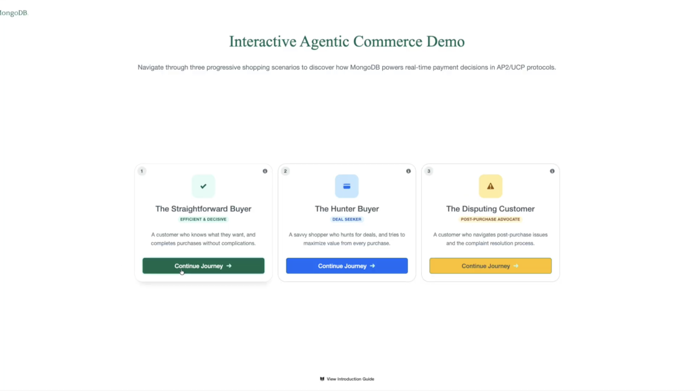
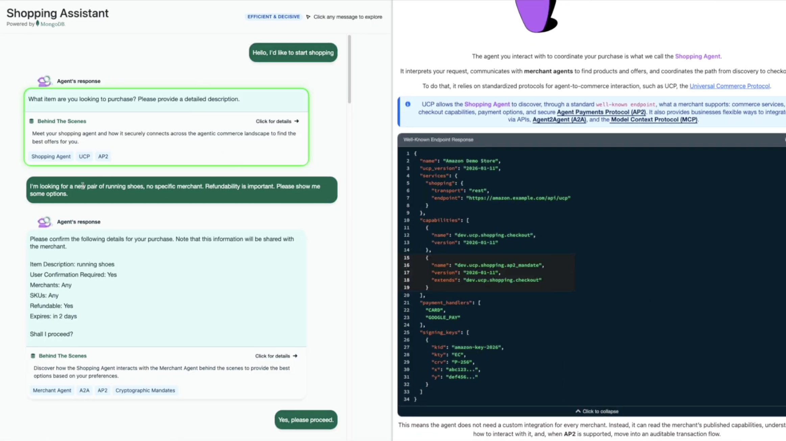
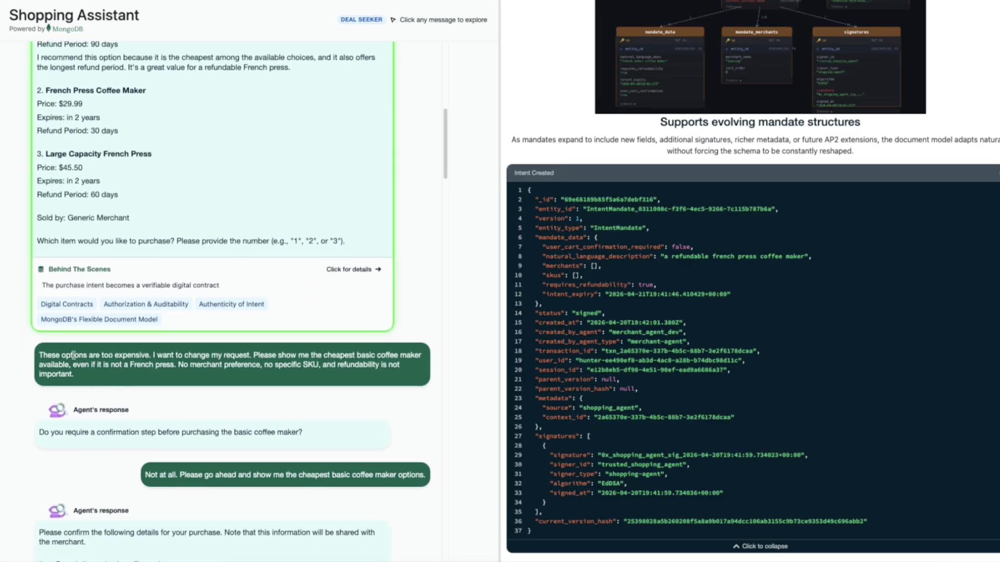
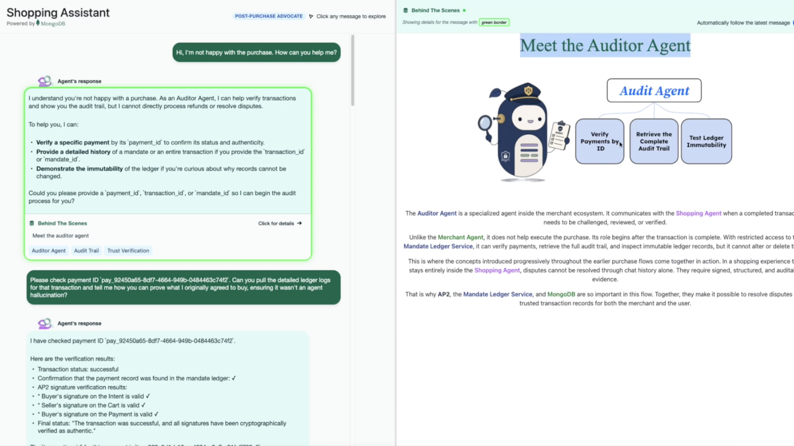
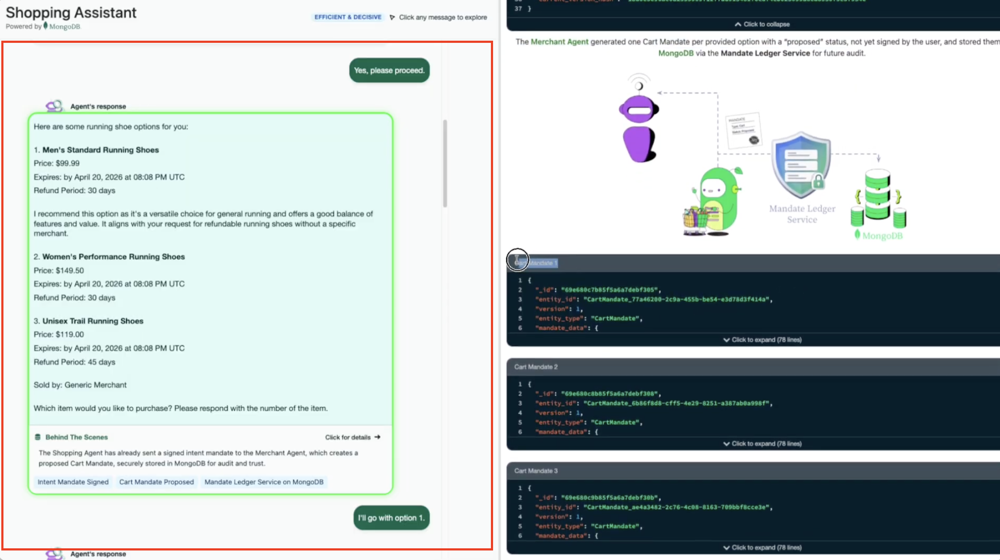
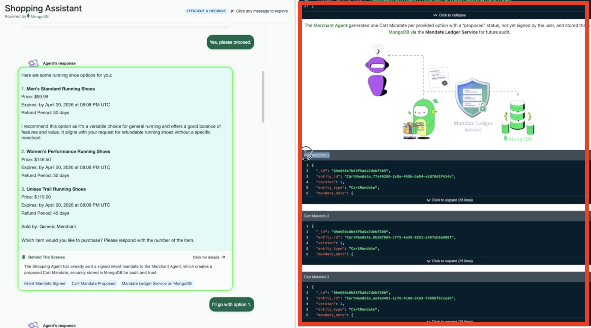

# User Guide: Interactive Agentic Commerce Demo

Use this guide after completing [README setup steps](README.md#-setup--run) and reaching **Step 5: Run Demo**.

## 1. Demo Objective

This demo showcases how **AP2 (Agent Payments Protocol)** and the **Mandate Ledger Service (MongoDB-backed)** work together to make agentic commerce trustworthy, auditable, and secure.

What you should observe while navigating:
- How shopping interactions are executed through an AI shopping agent.
- How AP2 mandate stages (intent, cart, payment) appear as the journey progresses.
- How the Mandate Ledger preserves an immutable, auditable record for each key action.

## 2. Where to Start

1. Open the app at `http://localhost:8080`.
2. On the landing page, review the introduction (optional) and select a journey card.
3. Complete journeys in sequence for the best experience:
	- Start with **The Straightforward Buyer**.
	- Continue with **The Hunter Buyer**.
	- Finish with **The Disputing Customer**.

## 3. The 3 Main Journeys

The main app contains three journeys. Each one is designed to highlight a different part of AP2 + Mandate Ledger behavior.

### 3.1 Journey 1: The Straightforward Buyer

- **Objective:** Experience the happy path with an efficient purchase flow and build a clear mental model of the agentic commerce process.
- **When to use:** First run of the demo.
- **Expected takeaway:** Understand baseline AP2 flow and where ledger-backed trust starts and the introduction to the Shopping Agent, Merchant Agent and Credentials Provider Agent.

### 3.2 Journey 2: The Hunter Buyer

- **Objective:** Explore a less direct, deal-seeking shopping path where intent can change and flow complexity increases.
- **When to use:** After starting/completing Straightforward.
- **Expected takeaway:** See how AP2 + Mandate Ledger handle evolving intent and maintain trustworthy execution history.

### 3.3 Journey 3: The Disputing Customer

- **Objective:** Simulate post-purchase verification and dispute context.
- **When to use:** After baseline journey setup.
- **Expected takeaway:** See how authorization, authenticity, and accountability can be verified using trusted records.

## 4. Inside Each Journey: How to Navigate

Each journey view has two core areas:

1. **Chatbot (main interaction area)**
	- This is where you chat with the shopping agent (or dispute/auditing flow agent).
	- Enter prompts and follow the guided options to progress the scenario.
	- Selected/important system messages may expose additional details in the sidebar.

	

	

2. **Left sidebar: Behind The Scenes**
	- This panel provides extra technical context for the selected message.
	- It explains what happened under the hood (for example, mandate-related stages and supporting details).
	- Treat it as the transparency panel for AP2 + Mandate Ledger events.

	

	
